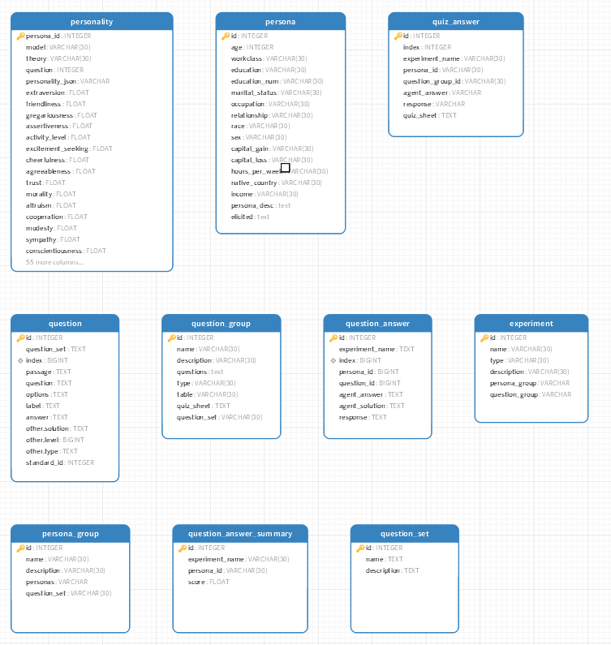

# AgenticSociety

#### Description
This repo is to support our work in applying language model agents in the research of social and economic discipline. 

#### Software Architecture
To facilitate small-scale data experiments and result observation and analysis, a studio desktop was developed. The general principle is that small-scale experiments can be conveniently defined using the studio, saving resources. Large-scale tasks are completed by specially developed Python scripts. Its functions are as follows:

1. Generate persona sampling
2. Define persona groups
3. Define question groups
4. Select persona groups and question groups, and define experiments
5. Execute experiments

Currently, the extraction and analysis of experimental results mainly support personality traits tests. It is important to note that the experimental results for the same persona in different experiments will overwrite each other in the personality table. However, this is only a temporary arrangement for the "extraction and analysis of experimental results." The personality table is also a temporary table for comprehensively extracting the results of personality traits tests. The raw data of the experiment results, such as the quest-answer and quiz-answer tables, are not interfered with by the results of different experiments.

The current top-level three packages:

1. asociety package, basic components
2. studio package, desktop studio
3. tools package, batch job scripts

vllm serve /data1/glm-4-9b-chat --trust_remote_code --tensor_parallel_size 2 --max_model_len 131072 --enforce_eager --enable_chunked_prefill --max_num_batched_tokens 8192
python -m vllm.entrypoints.openai.api_server --model /data1/glm-4-9b-chat --trust_remote_code --tensor_parallel_size 2 --max_model_len 131072 --enforce_eager --enable_chunked_prefill --max_num_batched_tokens 8192

NCCL_P2P_DISABLE=1
#### deta structure

Currently, the data is stored in the data/db/agent-society.db SQLite database file.

As shown in the image:

1. The persona table contains the sampling results and includes persona_desc, which is the result of enrichment by the LLM based on the skeletal feature vector.
2. The question table stores questionnaire questions, which are divided into question sets (question_set).
3. The question_group is defined by the studio and is equivalent to a questionnaire.
4. The persona_group is defined by the studio and is used to control the scale of a single experiment, 5. 5. keeping it small and manageable.
5. The question_answer table stores the results if the execution mode is one question per request.
6. The quiz_answer table stores the results if the execution mode is a grouped questionnaire, where one questionnaire is a quiz.

#### Installation

poetry install
#### Instructions

- Census data is located in data/census/csv.
- IPIP-NEO data is located in data/IPIP-NEO.
- Prompts are located in prompts.
- asociety is the engine part, while tools contains UI and tool scripts, including question set imports. The question set JSONL files are in data/test and are imported into SQLite using the tools.

#### Contribution

1.  yuqi.bai
2.  kun.sun

#### dataset

